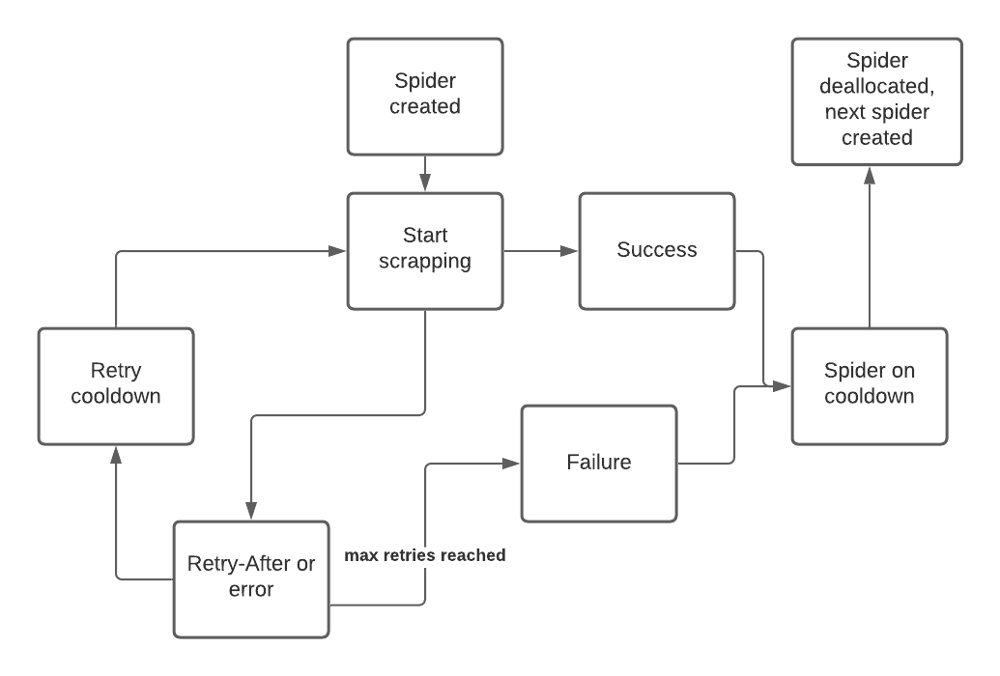

<p align="center">
  
</p><br>


[](https://codecov.io/github/DenTelezhkin/Swarm?branch=main)


[](https://github.com/apple/swift-package-manager)
[]()

Swarm is fast, simple and modular web-scrapping solution written in Swift.

## Features

- [x] Concurrently working spider instances
- [x] Automatic request repeat and slow-down when requested by the server
- [x] Customizable network layer (defaults to `URLSession`)
- [x] Depth first / breadth first options
- [x] Cross-platform

## Quickstart

```swift
class Scrapper: SwarmDelegate {
    lazy var swarm = Swarm(startURLs: [startingURL, anotherStartingURL], delegate: self)

    init() {
        swarm.start()
    }

    func scrappedURL(_ url: VisitedURL, nextScrappableURLs: @escaping ([ScrappableURL]) -> Void) {
        if let htmlString = url.htmlString() {
            // Scrap data from htmlString

            nextScrappableURLs([ScrappableURL(url: nextURL)])
        } else {
            nextScrappableURLs([])
        }
    }

    func scrappingCompleted() {
        print("Scrapping took: \(swarm.scrappingDuration ?? 0)")
    }
}
```

## Requirements

- Xcode 12 and higher
- Swift 5.3 and higher
- iOS 10 / macOS 10.12 / tvOS 10.0 / watchOS 3.0

> Although, if you are doing web scrapping on an Apple Watch, your use-case must be pretty wild :)

## Installation

### Swift Package Manager(requires Xcode 11)

* Add package into Project settings -> Swift Packages

If you build a package, based on Swarm, add following code to Package.swift:

```swift
.package(url: "https://github.com/DenTelezhkin/Swarm.git", .upToNextMajor(from: "0.1.0"))
```

### CocoaPods

```ruby
pod 'Swarm'
```

## Adding more urls

After initializing Swarm with starting URL's, you might add more using following method:

```swift
swarm.add(ScrappableURL(url: newURL, depth: desiredDepth))
```

Also, you can add more URL's to scrap as a result of `scrappedURL(_:nextScrappableURLs:)` delegate method callback:

```swift
nextScrappableURLs([ScrappableURL(url: nextURL)])
```

Please note, that there is no need to check those URL's for uniqueness, as internally URL's are stored in `Set`, and while scraping is in progress, visited URL's are saved in a log.

> Keep in mind, that calling `nextScrappableURLs` closure in `scrappedURL(_:nextScrappableURLs:)` delegate method is required, as Swarm is waiting for all such closures to be called in order to complete web-scraping.

## Configuration

`SwarmConfiguration` is an object passed during `Swarm` initialization. It has sensible defaults for all parameters, however if you need, you can modify any of them:

* Success status codes
* Delayed retry status codes
* Delayed retry delay
* Number of delayed retries before giving up
* Max auto-throttling delay (Swarm will try to adhere to "Retry-After" response header, but delay will not be larger than specified in this variable)
* Max authothrottled request retries before giving up
* Download delay (cooldown for each of the spiders)
* Max concurrent connections

> Example: downloadDelay = 1, .maxConcurrentConnections = 8 equates to approximately 8 requests in a second, excluding parsing time

## Depth or breadth?

Web-page can contain several links to follow, and depending on your agenda, you may want to go deeper or wider (e.g. do I want to get all items on the page first, and then load details on each of them, or vice-versa).

By default, Swarm operates as LIFO queue, ignoring depth entirely. You can, however, require depth first by setting this value in `SwarmConfiguration` object:

```swift
configuration.scrappingBehavior = .depthFirst
```

In this case, when selecting next URL to scrap, `Swarm` will choose `ScrappableURL` instance with biggest `depth` value. Alternatively, if `.breadthFirst` behavior is used, least `depth` url will be prioritized.

## Network transport

By default, `Swarm` uses `Foundation.URLSession` as network transport for all network requests. You can customize how requests are sent by adopting a delegate method:

```swift
func spider(for url: ScrappableURL) -> Spider {
    let spider = URLSessionSpider(url: url)

    // Handle cookies instead of ignoring them
    spider.httpShouldHandleCookies = true
    spider.userAgent = .static("com.my_app.custom_user_agent")
    spider.requestModifier = {
        var request = $0
        // Modify URLRequest instance for each request
        request.timeoutInterval = 20
        return request
    }
    // Modify HTTP headers
    spider.httpHeaders["Authorization"] = "Basic dGVzdDp0ZXN0"

    return spider
}
```

You can also implement your own network transport, if you need, by implementing simple `Spider` protocol:

```swift
public protocol Spider {
    init(url: ScrappableURL)

    func request(completion: @escaping (Data?, URLResponse?, Error?) -> Void)
}
```

Example of such implementation can be found in unit tests for `Swarm`, where [`MockSpider`](https://github.com/DenTelezhkin/Swarm/blob/main/Tests/SwarmTests/MockSpider.swift#L11) is used to stub all network requests in test suite.

## Spider lifecycle

A picture in this case is worth a thousand words.



## Being a friendly neighborhood web-scraper

With great tools comes great responsibility. You may be tempted to decrease download cooldown, increase parallelism, and dowload everything at speeds of your awesome gigabit Ethernet. Don't do that, please :)

First of all, going slower might actually mean that scrapping succeeds, and you won't get banned on servers you are trying to get data from. Also, going slower means that you will put less strain on servers, and will allow them to not slow down everyones (and yours) requests while server is processing all data requests it received.

Read [scrapy Common Practices doc](https://docs.scrapy.org/en/latest/topics/practices.html#avoiding-getting-banned), which generally applies to this framework too (in principle).

To expand on avoiding getting banned section of that doc, here are some tips for Swarm usage:

Use pool of rotating user-agents:

```swift
spider.userAgent = .randomized(["com.my_app.custom_user_agent", "com.my_app.very_custom_user_agent"])
```

Disable cookies:

```swift
spider.httpShouldHandleCookies = false
```

If you are hitting retry responses, slow-down by bumping up cooldown on spiders, and reducing concurrency:

```swift
configuration.downloadDelay = 2
configuration.maxConcurrentConnections = 5
```

To monitor retry responses, implement following delegate method, in which you can observe why `Swarm` decided to delay following request:

```swift
func delayingRequest(to url: ScrappableURL, for timeInterval: TimeInterval, becauseOf response: URLResponse?) {
  // Try inspecting (response as? HTTPURLResponse)?.statusCode
  // Also: (response as? HTTPURLResponse)?.allHeaderFields
}
```

## FAQ

### I'm into some serious web-scrapping, is this framework for me?

Well, depends. This project is built with simplicity in mind, as well as working on Apple platforms first, and Linux later. It works for my use case, but if you have more complex use case, you should look at [scrapy](https://docs.scrapy.org/en/latest/), which has much more features, as well as enterprise support.

Also, this project is written in Swift, while scrapy is written in Python, which can be both an upside and a downside, depending on where you are coming from.

### Why don't you have a built-in mechanism for extracting data?

This again goes back to simplicity. You might like [SwiftSoup](https://github.com/scinfu/SwiftSoup) for HTML parsing or you might like [Kanna](https://github.com/tid-kijyun/Kanna) to use XPath for extracting data. Maybe you even need a headless browser to render your web-pages first. With current approach, you install `Swarm`, and use any parsing library you need (if any).

### Is there a CLI?

No, and it's not planned. Building a Mac app [is trivial nowadays](https://developer.apple.com/documentation/swiftui/app) with just several lines of code, thus making a need for CLI obsolete at this moment.

### Is there support for Carthage package manager?

At this moment, no. There's no Xcode project in repository, and Carthage [does not directly support](https://github.com/Carthage/Carthage/issues/1226) using project generated from SwiftPM.

You can, however, work around this by following [this guide](https://fuller.li/posts/using-swift-package-manager-with-carthage/).

On the reason why I'm not including Xcode project in this repo - it's personal, I'm just very tired of managing dependencies using Carthage, which I find extremely slow, and extremely likely to break. CocoaPods, while judged by some people, is extremely popular, and has been working in production for me for years with much less issues then Carthage. Also, Swift Package Manager is currently my dependency manager of choice, as it has Xcode integration and actually beats CocoaPods in compilation speeds and simplicity.

### What's on the roadmap?

Depending on interest from community and my own usage of the framework, following features might be implemented:

- [ ] Linux support
- [ ] Automatic robots.txt parsing
- [ ] Automatic sitemap parsing
- [ ] Automatic link detection with domain restrictions
- [ ] Example usage on a server with [Vapor](https://github.com/vapor/vapor).
- [ ] External storage for history of visited pages
- [ ] Other stuff I'm currently not aware of

## License

`Swarm` is released under the MIT license. See LICENSE for details.
